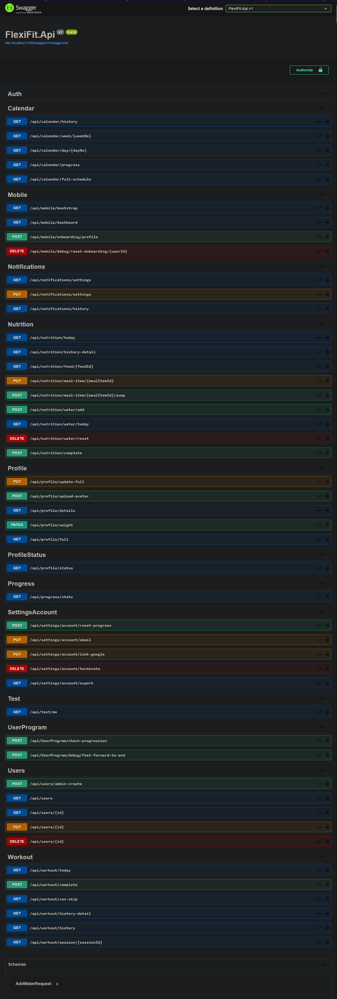

# FlexiFit API — Personalized Fitness & Nutrition Platform Core

**Status: Active Core Framework** — Authentication, Relational Schema Architecture, Engine Calculation Modules, and API Documentation Layer are fully operational and verified. Advanced Multi-Platform Sync engines are currently in progress (see [Roadmap](#-startup-modernization-roadmap)).

An inclusive, high-performance, and microservices-ready **REST Web API** engineered to power the entire FlexiFit personalized health ecosystem. The backend subsystem leverages a custom, deterministic, rule-based **Mathematical Logic Algorithm** to dynamically compute caloric boundaries, target macronutrient yields, and generate progressive athletic programming—featuring specialized, low-impact exercise tracking matrices designed specifically for user injury mitigation and active rehabilitation.

> **Startup & Enterprise-Ready Architecture:** While developed as a personal capstone initiative, this project was architected from Day One to adhere to rigid production-grade benchmarks. The system is designed to seamlessly scale into a SaaS framework or support sudden customer load spikes in a commercial startup launch.

---

## Technology Stack & Core Infrastructure

| Architecture Layer | Core Components / Technologies Used |
|---|---|
| **Backend Engine** | C# / .NET 8.0 (Modern Cross-Platform Enterprise Framework) |
| **Data Access / ORM** | Hybrid Data Layer utilizing Entity Framework Core (EF Core 8.0) and Dapper for high-performance direct SQL querying |
| **Authentication Infrastructure** | JSON Web Tokens (JWT Bearer Tokenization) & Firebase Admin SDK |
| **API Blueprint Layer** | Interactive Swagger UI Framework via Swashbuckle OpenAPI Specification |
| **Development Sandbox** | Independent Automated Staging Instance deployed on Microsoft Azure Services |
| **Version Management** | Git Distributed Version Control System with GitHub Workflows |

---

## Relational Database Architecture & Modular Schemas

The data layer is structured using modular relational boundaries with explicit naming conventions and entity table prefixes across **more than 40 database tables** to maintain peak query efficiency and audit tracking at scale:

- **`usr_` (User Profiling & Identity Telemetry):** Manages safe device tokens, customized notification rules, multi-factor onboarding configurations, and atomic historical transaction trails. It utilizes a dedicated tracking structure (`usr_user_profile_versions`) to support profile audit logs without compromising query speeds.
- **`ntr_` (Intelligent Nutrition Calculation Subsystem):** Maps automated allergy matrix systems (`ntr_user_allergies`), food database indexes, daily macro-tracking logs, and programmatic caloric calculations.
- **`wrk_` & `wkt_` (Workout Regimens & Athletic Progressions):** Houses the relational database layout for complex exercise templates, custom difficulty progression models (spanning Tiers 1 through 10), and rule-based physical condition filtering variables.

---

## Project Directory Tree & Structural Hierarchy

The solution enforces strict domain decoupling, keeping business rules, validation blocks, database entities, and external cross-cutting infrastructures isolated within dedicated folders:

```text
FlexiFit.Api/
├── Controllers/                         # REST API Request/Response Gateways
│   ├── AuthController.cs                # Token distribution & authentication
│   ├── CalendarController.cs            # Activity logs & schedule management
│   ├── MobileController.cs              # Low-latency endpoints for mobile client payload
│   ├── NotificationController.cs        # Telemetry updates & system alerts
│   ├── NutritionController.cs           # Caloric targets & dynamic macro equations
│   ├── ProfileController.cs             # Base biometric configurations
│   ├── ProfileStatus.cs                 # User health index status tracking
│   ├── ProgressController.cs            # Progressive workout leveling matrices
│   ├── SettingsAccountController.cs     # System identity credentials & parameter updates
│   ├── TestController.cs                # Environment runtime check tools
│   ├── UserProgramController.cs         # Workout tier mapping algorithms
│   ├── UsersController.cs               # Administrative user account management
│   └── WorkoutController.cs             # Injury condition logic filtering (e.g., Rehab)
├── Credentials/                         # Out-of-band external configurations
│   └── firebase-service-account.json    # Private identity platform tokens (Git-ignored)
├── Dtos/                                # Data Transfer Objects (Strict Request/Response Validation)
│   ├── AdminCreateUserDto.cs            # Admin privilege account provisioning limits
│   ├── AuthDtos.cs                      # Credential serialization structures
│   ├── BootstrapResponseDto.cs          # Client application initial bootstrap matrix
│   ├── CalendarHistoryDto.cs            # Workout and diet historical telemetry maps
│   ├── NotificationDto.cs               # Real-time message attributes
│   ├── NutritionDtos.cs                 # Mathematical macro response bounds
│   ├── OnboardingProfileRequest.cs      # Initial profile onboarding variable packets
│   ├── ProfileStatusResponse.cs         # Biometric tracker snapshots
│   ├── ProgressionResponseDto.cs        # User tier progress indexes
│   ├── ProgressTrackerDto.cs            # Continuous tracking metric layouts
│   ├── RefreshTokenRequest.cs           # Stateful session continuation properties
│   ├── TokenAuth.cs                     # Token verification parameters
│   ├── UpdateEmailDto.cs                # Identity state manipulation request
│   ├── UpdateGoogleEmailDto.cs          # Federated social login structural maps
│   ├── UpdateOnboardingRequest.cs       # Dynamic telemetry re-calculation indices
│   ├── UpdateWeightRequest.cs           # Core biometric mass index inputs
│   ├── UploadAvatarForm.cs              # Multi-part binary image stream definitions
│   ├── UserManagementResponse.cs        # Admin console dashboard objects
│   ├── UserProfileResponse.cs           # Account layout data objects
│   └── WorkoutDtos.cs                   # Routine configuration bundles
├── Entities/                            # Domain Data Layers & Database Schemas
│   ├── ActActivitySummary.cs            # Global physical tracking models
│   ├── DailyProgressLog.cs              # Atomic transaction entries
│   ├── FlexifitContext.cs               # Core EF Core Context class instance
│   ├── FlexifitDbContext.cs             # Target Relational Database mapping engine
│   ├── NtrAllergies.cs                  # Dynamic enterprise meal exemption systems
│   ├── NtrDailyLog.cs                   # Dietary intake recording tracks
│   ├── NtrDailyMealItemLog.cs           # Discrete ingredient measurement rows
│   ├── NtrDailyMealLog.cs               # Complete daily target meal buckets
│   ├── NtrFoodAllergies.cs              # Food element to cross-allergy mapping table
│   ├── NtrFoodItem.cs                   # Macronutrient structural item matrix
│   ├── NtrFoodItem.Extensions.cs        # Extended custom food calculation models
│   ├── NtrMealPlanCalendar.cs           # Relational dietary timeline allocations
│   ├── NtrMealTemplate.cs               # Standard caloric baseline models
│   ├── NtrTemplateDay.cs                # Cycle menu matrix configurations
│   ├── NtrTemplateDayMeal.cs            # Meal distribution templates
│   ├── NtrTemplateDayMealItem.cs        # Ingredient assignment components
│   ├── NtrUserAllergies.cs              # Personal client allergy mappings
│   ├── NtrUserCycleTarget.cs            # Custom nutritional timeframes
│   ├── NtrUserNutritionProfile.cs       # Math-driven personal metabolic targets
│   ├── NtrWaterLog.cs                   # Hydration tracking rows
│   ├── UsrDeviceToken.cs                # Device targeting registry
│   ├── UsrNotificationHistory.cs        # System push event logs
│   ├── UsrUser.cs                       # Primary system user entity
│   ├── UsrUser.Extensions.cs            # Helper domain method hooks
│   ├── UsrUserGeneralAchievement.cs     # Completed system awards and badges
│   ├── UsrUserMetric.cs                 # Chronological body weight tracking matrix
│   ├── UsrUserNotificationSetting.cs    # User push message alert choices
│   ├── UsrUserOnboardingDetail.cs       # Onboarding baseline metrics
│   ├── UsrUserProfile.cs                # Complete active biometric account info
│   ├── UsrUserProfileVersion.cs         # Audit trails for shifting historical profiles
│   ├── UsrUserProgramAchievement.cs     # Completed physical exercise awards
│   ├── UsrUserProgramInstance.cs        # Currently active workout roadmap assignments
│   ├── UsrUserSessionInstance.cs        # Session runtime diagnostic references
│   ├── UsrUserSessionWorkout.cs         # Real-time continuous monitoring logs
│   ├── UsrUserWorkoutProgress.cs        # Dynamic workload growth calculations
│   ├── UsrUserWorkoutSession.cs         # Complete workout tracking history
│   ├── VwNtrUserDailySummary.cs         # Consolidated SQL Server evaluation viewport
│   ├── WktWorkoutCalendar.cs            # System routine schedule charts
│   ├── WrkProgramTemplate.cs            # Algorithmic exercise template bounds
│   ├── WrkProgramTemplateDay.cs         # Split day schedule configurations
│   ├── WrkProgramTemplateDaytypeWorko.. # Complex relationship join specifications
│   ├── WrkWorkout.cs                    # Fundamental exercise movement model
│   └── WrkWorkoutLoadStep.cs            # Progressive loading parameters (Sets x Reps x Load)
├── Services/                            # Core Software Services & Business Logic Layers
│   ├── DeviceTokenService.cs            # Remote notification device tracking logic
│   ├── FirebaseTokenVerifier.cs         # Federated identity payload signature checks
│   ├── IUserService.cs                  # User management capability contract
│   ├── JwtService.cs                    # Custom JSON Web Token cryptographic signatures
│   └── UserService.cs                   # Concrete user identity workflow execution
├── scripts/                             # Infrastructure Deployment Automation
│   ├── redeploy-flexifit.ps1            # App Pool Interruption & Publishing Pipeline
│   └── redeploy-flexifit.bat            # Elevated execution execution bundle script
├── wwwroot/                             # Static Assets & Media Deployment Root
│   └── images/                          # Organized multi-track system images
│       ├── foods/                       # Dynamic menu visual assets (Keto, Vegan, etc.)
│       └── workouts/                    # Routine tutorial vectors (Cardio, Rehab, etc.)
├── appsettings.json                     # Shared Configuration Overlay (Production Settings)
├── appsettings.Development.json         # Local Environment Variables & Sandbox overrides
├── appsettings.template.json            # Clean Environment Configuration Blueprint
├── FlexiFit.Api.csproj                  # MSBuild XML Framework Dependencies Manifest
├── Program.cs                           # Primary Web Host Engine Bootstrap Execution entry
└── README.md                            # Comprehensive Architecture System Documentation

```

## Deep Engineering & Hardening Features

1. **Hybrid Identity Federation Validation:** Implements token payload verification passed directly from the client layer utilizing the Firebase Admin SDK, validating matched records inside our core database storage for maximum identity safety.
2. **Decoupled Security Padlocks:** Protects exposed REST routes using granular JWT authorization decorators, mapping strict execution barriers bounded to authentic `USER` or `ADMIN` enterprise security definitions.
3. **Advanced Memory-Cache Strategy:** Leverages localized memory-caching abstractions (`IMemoryCache`) to bypass repetitive operational checks against the relational database engine, significantly mitigating database request congestion for high-frequency settings queries.
4. **Isolated Sandbox Staging Pipeline:** Maintained via an active developer staging branch mapped directly to a **Microsoft Azure Instance via GitHub Actions CI/CD pipelines** to safely validate cross-origin resource adjustments and server runtime configurations using safe synthetic test profiles.

---

## Local Staging Setup & Execution Framework

### Environment Prerequisites
Ensure your local terminal contains the following runtime libraries prior to local setup:
- [.NET Core 8.0 SDK](https://dotnet.microsoft.com/en-us/download/dotnet/8.0)
- [Microsoft SQL Server / SQL Server Express Edition](https://www.microsoft.com/en-us/sql-server/sql-server-downloads)
- Integrated Development Environment (Visual Studio 2022 / VS Code)

### Installation Instructions

1. **Clone the repository locally:**
   ```bash
   git clone https://github.com/CjConvento/FlexiFit.Api
   cd FlexiFit.Api
   ```

2. **Configure Application Overlays:**
   Establish your own customized data endpoints inside `appsettings.Development.json` using the global workspace template.
   - **JWT Key Layer:** Insert a reliable 256-bit secure secret passphrase inside `JwtSettings:Secret`.
   - **Firebase Credentials:** Download your secure administration workspace profile configuration private key (`.json`) straight from the Firebase Console (**Project Settings > Service Accounts**) and link the exact filepath into your application runtime configs.

3. **Establish Core Connection Metrics:**
   Map your target database configuration strings pointing to your local SQL Server instance inside the designated properties of `ConnectionStrings:DefaultConnection`.

---

## Running the Staging Web API

Initialize compilation workflows by firing these commands inside your terminal workspace:

1. **Purge legacy compilation cached parameters:**
   ```powershell
   dotnet clean
   ```

2. **Launch the core system execution loop:**
   ```powershell
   dotnet run
   ```

> **Local Host Note:** Once the terminal logs confirm that the server boot configuration is complete, the application hosting pipeline will run locally on your machine. You can view your localized endpoints directly via your environment's default hosting ports.

---

## Connected Applications & Client Ecosystem

To view how this backend services cluster connects with consumer-facing environments, you may explore the corresponding repository tracking branches:

| Subsystem Component | Target Access Gateway Link | Operational Context & Framework |
| :--- | :--- | :--- |
| **Mobile Client App** | [Explore Frontend App Source](https://github.com/CjConvento/FlexiFitApp_Initial) | **Native Android Application Architecture** built using Kotlin to integrate seamlessly with our C# Web API endpoints, handling user data sessions via secure JWT bearer tokens. |
| **API Blueprint Layer** | [Interact with the Live Swagger UI](https://flexifit-api-bqdrdcchf8faagat.japaneast-01.azurewebsites.net/swagger/index.html) | **Cloud Sandbox Staging.** Live documentation playground hosted on Azure App Service to test calculations and route responses inside real-time executions. |

---

## Startup Modernization & Scaling Roadmap

- [ ] **Distributed Caching Migration:** Migrating the existing localized memory caching framework (`IMemoryCache`) into a high-performance **Redis Distributed Cache** registry. This architectural refactoring track isolates application runtime memory, preserves cache state across web host restarts, and prepares the backend architecture for distributed load balancing.
- [ ] **Cross-Platform Mobile Interface Migration:** Shifting the native Kotlin frontend implementation layer to a cross-platform **Flutter (Dart)** infrastructure to uniformly expand client application deployment reach across both iOS and Android stores from a single code base.
- [ ] Implement robust horizontal table data pagination frameworks and localized text fuzzy searching modules across all large entity endpoints.
- [ ] Introduce real-time automated workout compliance notifications and telemetry alert loops.

---

## API Documentation Preview
Below is the layout map of the exposed modules as seen on the interactive Swagger UI layer:



---

## Project Author

[Natajimura](https://github.com/CjConvento) - Cj Convento
- Junior .NET Software Engineer
- Designed and maintained as a production-ready portfolio asset targeting high-performance commercial applicability.
